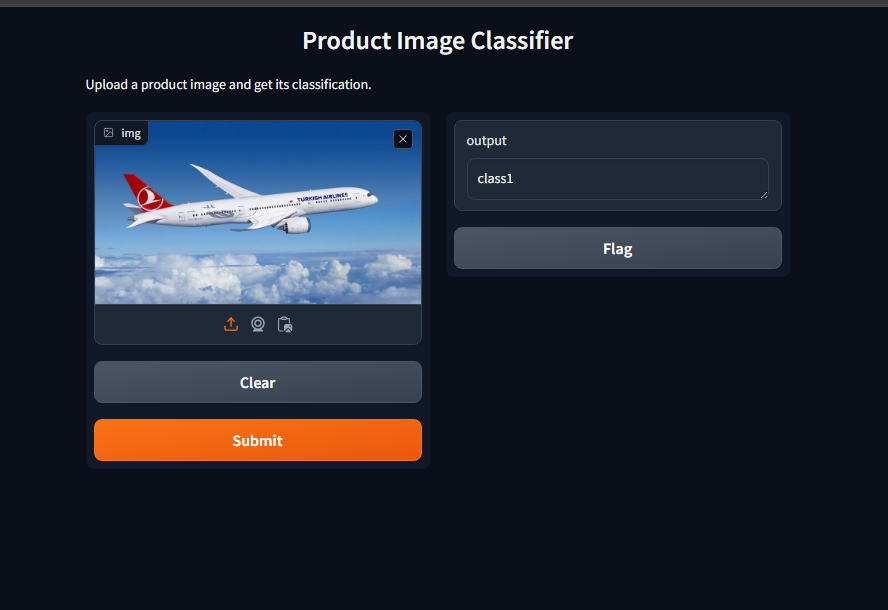

# Product Image Classifier
A computer vision project that classifies product images using MobileNetV2. The project includes model fine-tuning, evaluation, and a GUI for easy user interaction. The GUI is implemented with both Tkinter and Gradio, and the final choice is based on usability comparison.

## Features

Model: MobileNetV2 fine-tuned on custom image classes

GUI: Gradio interface for image upload and classification; Tkinter used for comparison

Evaluation: Confusion matrix generated for small dataset

Fine-tuning: Pretrained weights adapted to custom classes

Project Structure
cv_project/
├── data/processed/           # Images per class
├── models/best_model.pth     # Trained MobileNetV2 model
├── reports/                  # Confusion matrix, metrics
├── src/
│   ├── infer.py              # Gradio inference
│   ├── evaluate.py           # Evaluation
│   └── preprocess.py         # Image preprocessing
├── README.md
└── requirements.txt

Quick Start
# Install requirements
pip install -r requirements.txt

# Run Gradio interface
python src/infer.py

Fine-tuning Explanation

We used a pretrained MobileNetV2 and only trained the classifier head on our small dataset.
This approach:

Speeds up training

Reduces overfitting on small datasets

Maintains strong feature extraction from pretrained convolutional layers

Technology Stack

Python 3.9+

PyTorch & Torchvision

Gradio / Tkinter

NumPy, Pandas

Matplotlib, Seaborn

Türkçe Özet

Bu proje, MobileNetV2 ile ürün görsellerini sınıflandıran bir uygulamadır.

Model Eğitimi & Fine-tuning: Önceden eğitilmiş MobileNetV2 modeli kendi sınıflarımıza göre adapte edildi.

Arayüz Karşılaştırması: Tkinter ve Gradio arayüzleri test edildi; kullanıcı deneyimi ve kullanım kolaylığı göz önünde bulundurularak Gradio tercih edildi.

Değerlendirme: Mini veri seti üzerinde sınıflandırma sonuçları confusion matrix ile görselleştirildi.